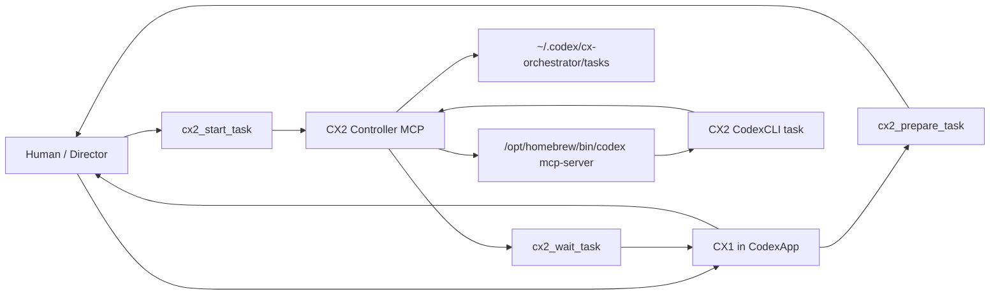

# CX Orchestrator

[English README](README.md)

CX Orchestrator は、CodexApp 上の CX1 スレッドから、CodexCLI ベースの CX2 worker を MCP 経由で制御する local-first Codex plugin です。

これは OpenAI 公式プロジェクトではありません。

Current version: `0.1.5`

Maintainer: [ymt23](https://github.com/ymt23)

## Status

CX Orchestrator は現在、local-first の Codex plugin です。CodexApp の CX1 スレッドから CodexCLI の CX2 worker へ、Human 承認済みの task だけを監査可能な形で渡したい maintainer 向けに設計されています。

## Requirements

- local plugin support を持つ CodexApp。
- `/opt/homebrew/bin/codex` にインストールされた CodexCLI。
- Node.js 18 以上。
- `~/.codex/config.toml` で設定された local Codex plugin marketplace。
- 主な検証環境は macOS です。

## この Plugin が行うこと

- CX1 は CodexApp 内で Human-facing のまま動作します。
- CX1 は各 CX2 task の前に runtime を選択し、model、reasoning effort、speed を表示します。
- Human は CX2 開始前に exact prompt を確認して承認します。
- CX2 は `cx2_controller` MCP server 経由で実行されます。
- CX1 は CX2 の status change を待ち、approval request の処理、task stop、結果 review を行います。
- full task log は Codex home directory 配下に保存されます。

## Safety Model

- CX2 は Human が exact prompt を承認した後にのみ開始されます。
- CX2 approval request は CX1/Human に中継されます。
- shell、patch、tool request の automatic approval は実装していません。
- commit は明示的に要求されない限り拒否されます。
- runtime log は標準では target repository の外に保存されます。
- この repository は API key や service token を必要としません。

## 重要な Path

```text
.codex-plugin/plugin.json
.mcp.json
skills/cx1-orchestrator/SKILL.md
mcp/cx2-controller/src/server.mjs
mcp/cx2-controller/config/defaults.json
mcp/cx2-controller/schemas/
mcp/cx2-controller/test/smoke.mjs
docs/INDEX.md
.codex/policies/CODEX_POLICY.md
.codex/skills/cx-orchestrator-maintainer/SKILL.md
```

外部 runtime path:

```text
~/.agents/plugins/marketplace.json
~/.codex/config.toml
~/.codex/cx-orchestrator/tasks/
```

## 最初に読むもの

新しい development chat では、次の順で読んでください。

1. `AGENTS.md`
2. `.codex/policies/CODEX_POLICY.md`
3. `docs/INDEX.md`
4. `.codex/skills/cx-orchestrator-maintainer/SKILL.md`

利用手順は `docs/operation.md` から確認してください。

## Architecture



## Quick Verification

```sh
node --check mcp/cx2-controller/src/server.mjs
node mcp/cx2-controller/test/smoke.mjs
node mcp/cx2-controller/test/wait.mjs
node mcp/cx2-controller/test/model-settings.mjs
```

## Installation

この repository を local marketplace root 配下に clone し、Codex config で plugin を有効化します。

例:

```toml
[plugins."cx-orchestrator@local"]
enabled = true

[marketplaces.local]
source_type = "local"
source = "/path/to/local/marketplace/root"
```

marketplace root には、この repository を `plugins/cx-orchestrator` として配置します。環境側の Codex plugin configuration が別の構成を許容している場合は、その設定に従ってください。

## Known Limitations

- この project は OpenAI と提携しておらず、OpenAI 公式 project ではありません。
- `0.1.x` では `app-server` integration を意図的に scope 外にしています。
- host 側の wake/resume behavior が保証されていないため、callback または push-based の CX1 turn resumption は前提にしていません。
- default CodexCLI binary path は `/opt/homebrew/bin/codex` に固定されています。
- 実行中の CX2 task は model、reasoning effort、speed を途中変更できません。
- `max_retries` は validate / 保存されますが、retry loop はまだ実装していません。
- approval automation を拡張する前に、実際に approval を発生させる CodexCLI task で検証する必要があります。

## Roadmap Ideas

以下は将来的な方向性の候補であり、release promise ではありません。

- syntax check、JSON validation、controller test 用の GitHub Actions を追加する。
- local marketplace configuration の安全な install check または setup script を追加する。
- approval request handling と failure recovery の test を増やす。
- `max_retries` 用の明示的な retry loop を実装する。
- task list filtering と task summary inspection tool を追加する。
- 明示的な compatibility check 付きで CodexCLI binary path を configurable にする。
- issue report や maintainer handoff 用の sanitized log export を追加する。
- host environment に確認済みの仕組みが提供された場合のみ、callback-based CX1 wake/resume を再検討する。

## Versioning

plugin manifest version と controller version は現在 `0.1.5` です。

behavior、tool、config、schema、operation policy を変更した場合は `CHANGELOG.md` を更新してください。

## License

MIT. See `LICENSE`.
