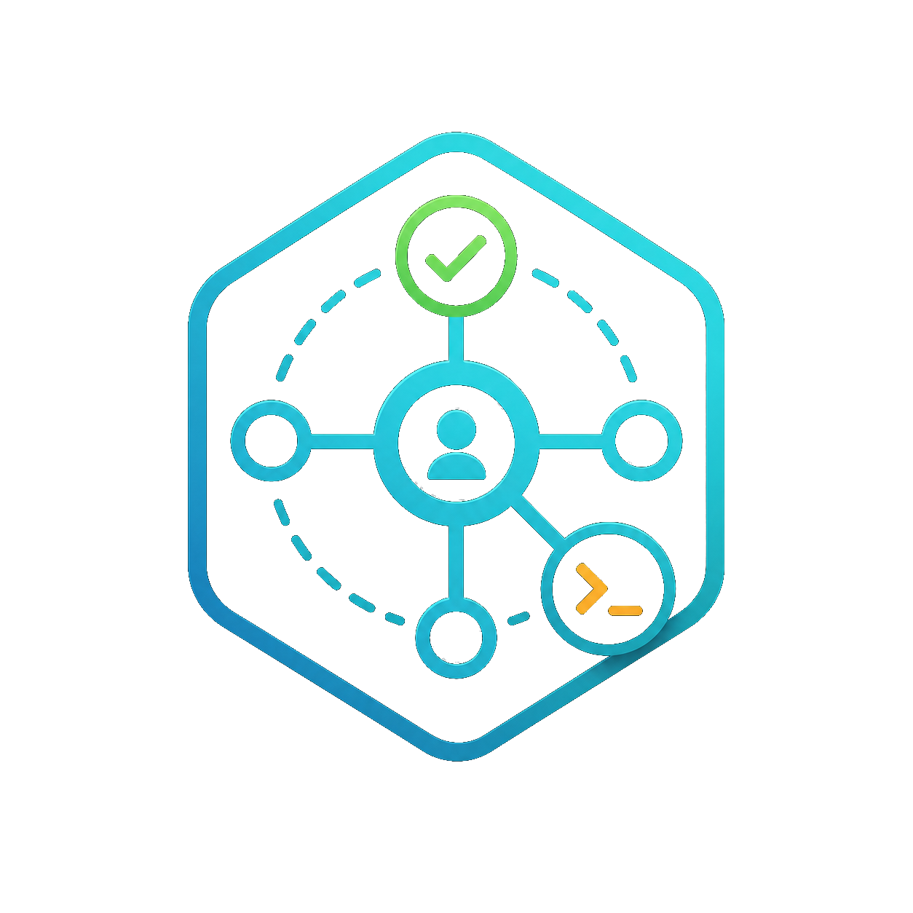
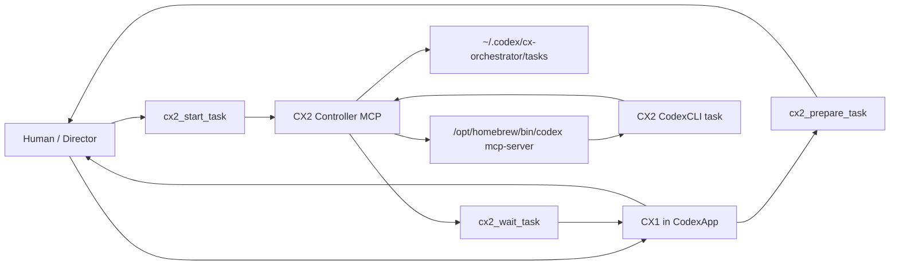

# CX Orchestrator

<div align="center">



[](https://github.com/ymt23/cx-orchestrator/actions/workflows/ci.yml)
[](https://github.com/ymt23/cx-orchestrator/releases)
[](LICENSE)
[](https://nodejs.org/)
[](README.md)

[](README.ja.md)

CX Orchestrator is a home-local Codex plugin that lets a CX1 CodexApp thread coordinate a controlled CX2 CodexCLI worker through MCP.

This is not an official OpenAI project.

</div>

## Status

CX Orchestrator is currently a local-first Codex plugin. It is intended for maintainers who want an auditable Human-approved handoff from a CodexApp CX1 thread to a CodexCLI CX2 worker.

## Requirements

- CodexApp with local plugin support.
- CodexCLI installed at `/opt/homebrew/bin/codex`.
- Node.js 18 or newer.
- A local Codex plugin marketplace configured in `~/.codex/config.toml`.
- macOS is the primary tested environment.

## What This Plugin Does

- CX1 stays Human-facing inside CodexApp.
- CX1 selects and displays CX2 runtime before each task: model, reasoning effort, and speed.
- Human reviews and approves the exact prompt before CX2 starts.
- CX2 runs through the `cx2_controller` MCP server.
- CX1 waits for CX2 status changes, handles approval requests, stops tasks when needed, and reviews results.
- Full task logs are kept under the Codex home directory.

## Safety Model

- CX2 starts only after Human approval of the exact prompt.
- CX2 approval requests are routed back to CX1/Human.
- Automatic shell, patch, or tool approval is not implemented.
- Commits are denied unless explicitly requested.
- Runtime logs are kept outside the target repository by default.
- No API keys or service tokens are required by this repository.

## Important Paths

```text
.codex-plugin/plugin.json
.mcp.json
skills/cx1-orchestrator/SKILL.md
mcp/cx2-controller/src/server.mjs
mcp/cx2-controller/config/defaults.json
mcp/cx2-controller/schemas/
mcp/cx2-controller/test/smoke.mjs
docs/INDEX.md
.codex/policies/CODEX_POLICY.md
.codex/skills/cx-orchestrator-maintainer/SKILL.md
```

External runtime paths:

```text
~/.agents/plugins/marketplace.json
~/.codex/config.toml
~/.codex/cx-orchestrator/tasks/
```

## Read First

For new development chats, read in this order:

1. `AGENTS.md`
2. `.codex/policies/CODEX_POLICY.md`
3. `docs/INDEX.md`
4. `.codex/skills/cx-orchestrator-maintainer/SKILL.md`

For user-facing operation, start from `docs/operation.md`.

## Current Architecture



## Quick Verification

```sh
node --check mcp/cx2-controller/src/server.mjs
node mcp/cx2-controller/test/smoke.mjs
node mcp/cx2-controller/test/wait.mjs
node mcp/cx2-controller/test/model-settings.mjs
node scripts/test-check-local-setup.mjs
```

## Installation

Clone this repository under a local marketplace root, then enable it from Codex config.

Example:

```toml
[plugins."cx-orchestrator@local"]
enabled = true

[marketplaces.local]
source_type = "local"
source = "/path/to/local/marketplace/root"
```

The marketplace root should contain this repository at `plugins/cx-orchestrator`, or the local marketplace should otherwise point to the repository according to the Codex plugin configuration available in your environment.

To diagnose local marketplace configuration without modifying any config files, run:

```sh
node scripts/check-local-setup.mjs
```

## Known Limitations

- This project is not affiliated with or endorsed by OpenAI.
- `app-server` integration is intentionally out of scope for `0.1.x`.
- Callback or push-based CX1 turn resumption is not assumed because host-side wake/resume behavior is not guaranteed.
- The default CodexCLI binary path is fixed to `/opt/homebrew/bin/codex`.
- Running CX2 tasks cannot change model, reasoning effort, or speed mid-task.
- `max_retries` is validated and stored, but a retry loop is not implemented yet.
- Real approval-producing CodexCLI tasks should be verified before expanding approval automation.

## Roadmap Ideas

These are possible future directions, not committed release promises.

- Track post-release work in [docs/roadmap.md](docs/roadmap.md) and GitHub Issues.
- Add a safer installation check or setup script for local marketplace configuration.
- Add more tests around approval request handling and failure recovery.
- Implement a documented retry loop for `max_retries`.
- Add task list filtering and summarized task inspection tools.
- Support configurable CodexCLI binary paths with explicit compatibility checks.
- Add sanitized log export for issue reports and maintainer handoffs.
- Revisit callback-based CX1 wake/resume only if the host environment provides a confirmed mechanism.

## Versioning

The plugin manifest version and controller version are currently `0.1.6`.

Update `CHANGELOG.md` whenever behavior, tools, config, schemas, or operating policy changes.

## License

MIT. See `LICENSE`.
