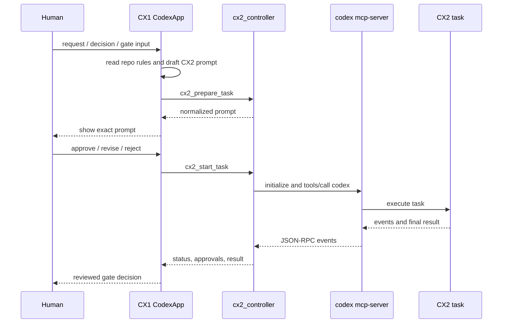

# Architecture

## Goal

The plugin automates the existing manual CX1 to CX2 copy-paste workflow without changing the decision boundary:

- Human talks only to CX1.
- CX1 decides what CX2 should do, but must show the exact prompt to Human before dispatch.
- CX2 performs task-scoped engineering work and reports back through the controller.
- CX1 reviews CX2 output and turns it into a Human-facing gate decision.

## Components

### CodexApp CX1

CX1 is the Human-facing chat in the target project. It uses the `cx1-orchestrator` skill and the `cx2_controller` MCP tools.

Responsibilities:

- gather requirements from Human
- read project-local rules
- draft CX2 prompts
- obtain Human approval
- start and poll CX2 tasks
- forward approval requests
- review final CX2 output
- report gate decisions

### CX2 Controller MCP

The controller is implemented in `mcp/cx2-controller/src/server.mjs`.

Responsibilities:

- expose stable orchestration tools to CodexApp
- normalize task prompts
- enforce required limits
- start `/opt/homebrew/bin/codex mcp-server`
- call the CodexCLI `codex` MCP tool
- track task status
- persist full logs
- stop tasks on request or timeout
- return normalized result artifacts

### CodexCLI CX2

CX2 is a CodexCLI-backed task started by the controller. The current adapter uses `/opt/homebrew/bin/codex mcp-server`.

The actual CodexCLI MCP tools observed in initial verification were:

- `codex`
- `codex-reply`

The controller therefore adapts its own stable tools to the CodexCLI `codex` tool instead of assuming a thread/start protocol.

## Control Flow

## Version 0.1.0 Constraints

- `app-server` is not used.
- Dependencies are limited to Node.js standard library.
- Controller MCP/JSON-RPC handling is implemented directly.
- Commit is denied unless explicitly approved.
- Human approval is required before CX2 dispatch.
- Automatic approval of CX2 shell / patch / tool requests is not allowed.
- Logs are stored under Home, not under the target repo.
